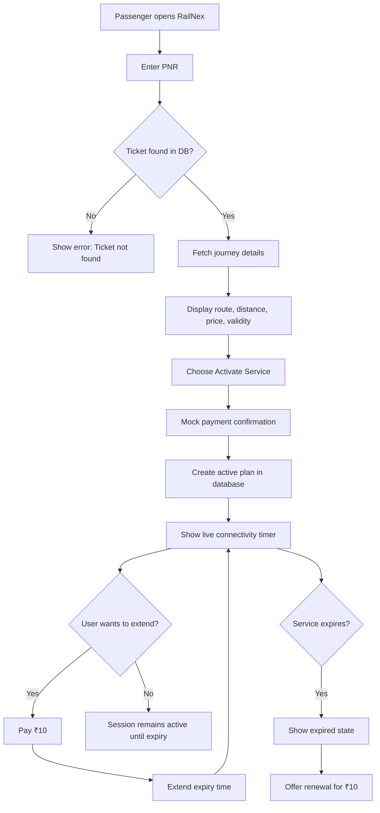

# RailNex

RailNex is a railway passenger connectivity prototype designed to make onboard internet access feel simple, trustworthy, and easy to use during travel. A passenger enters a PNR, verifies the ticket, selects a plan based on journey distance, and activates internet access with a mock payment flow.

The product is built as a realistic demo of how railway connectivity services could work in a train environment, combining a browser-based experience with a lightweight API and database backend.

## Product Preview
The user experience is structured around a clean four-step journey:

1. Verify ticket — the rider enters a 10-digit PNR to confirm the train booking.
2. Review plan — the app displays source, destination, route distance, valid plan price, and service duration.
3. Activate service — the customer pays a mock amount and starts the onboard connectivity session.
4. Monitor usage — the app shows an active countdown timer, connection telemetry, and the option to extend the plan.

This makes the prototype feel like a real passenger-facing rail service rather than a simple demo screen.

## User Flow



## UI Screen Explanation
- Verify screen: A clean ticket-check page with a large PNR input field and quick access buttons for sample tickets.
- Plan screen: Shows the confirmed route, pricing, and validity window before activation.
- Active session screen: Displays the live countdown timer, train-route summary, and connection metrics such as download speed and latency.
- Expired state: Informs the traveler that service has ended and offers a quick renewal option for another ₹10.

## Features
- Verify a PNR and return train route details from the database
- Calculate service price and validity based on trip distance
- Activate internet for a valid ticket with a mock payment flow
- Extend connectivity by paying an additional ₹10
- Show live countdown and session status in the UI
- Use seeded demo tickets for fast testing and demonstrations

## Tech Stack
- Frontend: HTML, CSS, JavaScript
- Backend: FastAPI
- Database: SQLite

## Project Structure
- `frontend/`: User interface for ticket verification and plan activation
- `backend/`: API logic for verification, payment, activation, extension, and status checks
- `database/`: SQLite database file and schema initialization

## Quick Start

### 1) Backend setup
From the project root:

```bash
cd backend
python -m venv venv
```

Activate the virtual environment:

```bash
# Windows
venv\Scripts\activate

# macOS / Linux
source venv/bin/activate
```

Install dependencies:

```bash
pip install -r requirements.txt
```

Start the API:

```bash
uvicorn main:app --reload
```

The backend will run at:

```text
http://127.0.0.1:8000
```

### 2) Frontend setup
Open the HTML app directly in a browser:

```text
frontend/index.html
```

Or serve it locally:

```bash
cd frontend
python -m http.server 3000
```

Then open:

```text
http://localhost:3000
```

## Demo Data
The app seeds the database with these sample tickets:

- `1234567890` — Delhi to Ludhiana, 312 km
- `1111111111` — Ludhiana to Jalandhar, 65 km
- `2222222222` — Delhi to Ambala, 198 km

These are useful for testing the verify flow and plan activation without adding custom records.

## API Overview
The backend exposes these main endpoints:

- `POST /verify-ticket` — Validate a PNR and return journey details
- `POST /payment` — Mock payment success for plan purchase or extension
- `POST /activate` — Activate service for the provided PNR
- `POST /extend` — Extend active plan validity by 60 minutes after payment
- `GET /status` — Return current active/expired/inactive state for a PNR

## How the app works
1. Enter a PNR in the frontend.
2. The app verifies the ticket against the SQLite database.
3. The system calculates price and validity based on the distance.
4. The user pays through the mock payment flow.
5. The service activates and displays the remaining countdown timer.
6. A user can extend validity again by paying ₹10.

## Notes
- The project is intentionally a prototype and uses mock payments.
- CORS is enabled for local frontend-backend communication during development.
- The database is created automatically when the backend starts.

## Future Improvements
- Add real authentication and secure ticket validation
- Connect to a payment gateway
- Add route-based pricing rules and richer journey metadata
- Improve the UI with a more production-like dashboard
- Move from SQLite to a more scalable database for production use
